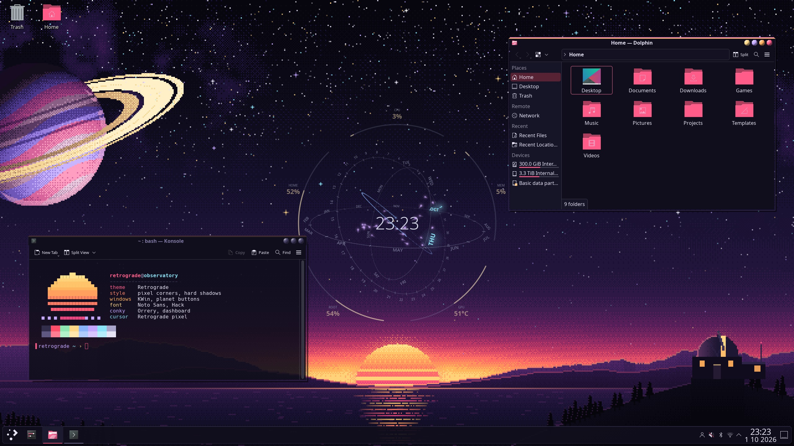
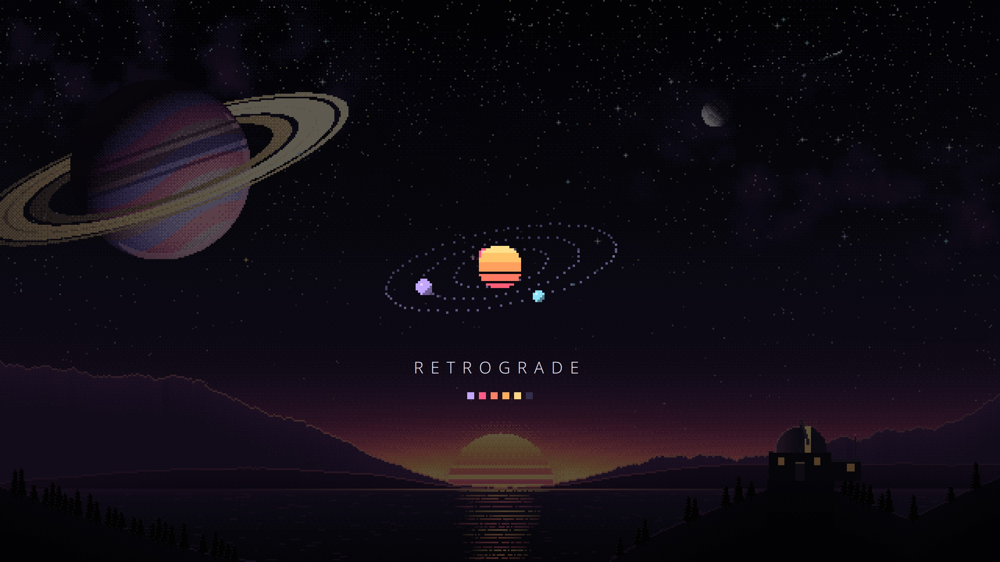
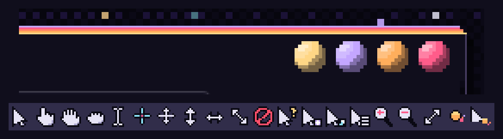
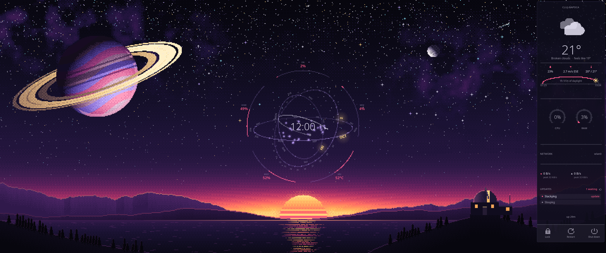
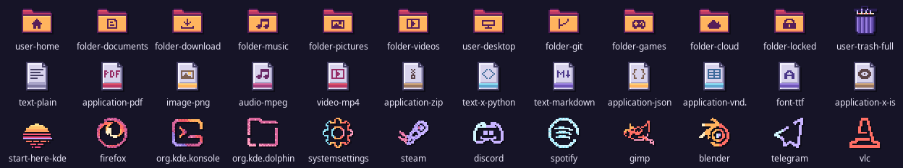

# Retrograde

A dark, retro global theme for KDE Plasma 6: a pixel-art dusk over an
observatory, window buttons that are pixel planets, and a 1970s sunset stripe
across the top of whatever window you are working in. Made to sit behind
[Conky Orrery](https://github.com/alexsson-xexpanderx/Conky-themes) and
conky-dashboard.



- **Wallpaper**: pixel art, painted at about 360 pixels tall and enlarged with
  hard edges, in ten sizes from 1280×800 to 5120×1440, ultrawide included.
- **Window decoration**: stepped pixel corners, a hard drop shadow, and planet
  buttons that show their glyph when you point at them.
- **Plasma style**: panel, popups, tooltips and task manager in the same pixel
  shapes, the sunset stripe across the top of every popup.
- **Colours**: one palette for apps, Plasma, Konsole and the decoration.
- **Icons**: pixel art in the wallpaper's colours: hand-made folders and file
  pages, and some 3,000 app and system icons converted from
  [candy-icons](https://github.com/EliverLara/candy-icons).
- **Cursors**: pixel art, crisp at every size.
- **Splash screen**: a little pixel orrery turning over the night sky.
- **Konsole** colour scheme and profile, and `retrofetch`, a fetch with a pixel
  sun for a logo.

Text is never pixelated. Everything you read is set in Noto Sans and Hack.

**Install it:**

```bash
./install.sh --apply
```

That copies the theme into `~/.local/share` and switches to it. Leave out
`--apply` to only install it, then pick **Retrograde** in System Settings →
Colors & Themes → Global Theme. `./uninstall.sh` takes it out again.

The rest of this page is detail. Nothing below is needed to use it.

---





## What it changes

Applying a global theme sets these, all of them from this theme:

| | |
|---|---|
| Colours | Retrograde |
| Application style | Breeze, coloured by the scheme |
| Plasma style | Retrograde |
| Window decoration | Retrograde (Aurorae) |
| Icons | Retrograde, falling back to Breeze Dark for toolbar icons |
| Cursors | Retrograde-cursors |
| Fonts | Noto Sans 12, window titles in bold |
| Splash screen | Retrograde |
| Wallpaper | Retrograde Dusk |

It brings no panel layout, so your panels and widgets stay as they are.

The fonts are the ones both conkies draw in, so the desktop and the widgets
read as one thing. If you would rather keep yours, set them again afterwards
in System Settings → Text & Fonts: the global theme dialog applies fonts along
with the rest of the appearance.

## The palette

Night tones are a blue-violet near-black, the sky an hour after sunset. The
accents are the sunset itself, top to bottom the stripe across every active
window:

| | |
|---|---|
| `#C3A6FF` | mauve |
| `#FF5C8A` | pink, the accent: selection, focus, the active task |
| `#FF8266` | coral |
| `#FFAE5C` | amber |
| `#FFD685` | gold |
| `#8BE3F7` | sky: links, and the Orrery's "today" |

These are the Catppuccin-family colours Conky Orrery already uses, pushed a
little warmer. Selected text is dark on the pink rather than white, which
reads at 6.5:1 where white would manage 2.9:1.

## Matching the conkies

**Conky Orrery** needs nothing: its palette is where this one started. The
wallpaper keeps the middle of the sky dark and empty for its rings, and puts a
striped sun on the horizon just under it, so it hangs over the sunset like an
instrument on a stand. Its readouts at the bottom (root and GPU) sit on dark
violet rather than the bright part of the sunset, so they stay readable.

For the full effect there are pixel-art copies of both conkies, in
`extras/conky-orrery-pixel` and `extras/conky-dashboard-pixel`. Their rings,
gauges, arcs and icons are drawn in the wallpaper's own pixels and colours,
while all their writing stays sharp. The pixel Orrery takes its colours from
the sun beneath it: today's date in gold, the readouts in pink. See the
READMEs there.



To start them at login, copy the entries in `extras/autostart` to
`~/.config/autostart` (they expect the repository at `~/git/kde-plasma-themes`)
and disable the originals' entries, if you have them.

**conky-dashboard** draws in `#FF4081`, a step pinker than the theme's
`#FF5C8A`. They already sit well together; for an exact match set
`accent = "#FF5C8A"` in `lua/dashboard.lua`. The right-hand edge of the
wallpaper is quiet sky, which is where the dashboard goes.

## Icons



Every icon is drawn on a grid of square pixels, 24 across for 24 px and up and
16 across for the small sizes, so at 48 px one icon pixel is 2×2 screen pixels,
the same pixel as the window frame's. They are SVGs, so they stay sharp at
fractional display scales too.

- **Folders** are hand-made: a pink back and an amber front, the sun going down
  behind the hills. Documents, Downloads, Music, Pictures and the other common
  places carry a symbol drawn for them; the rest of candy's hundred-odd folder
  variants keep the symbol lifted off candy's own. Dolphin's Folder Color menu
  gets its own red, orange, yellow, green, cyan, blue, violet, magenta, brown,
  grey and black.
- **Files** are hand-made too: a page with its corner folded, a band of colour
  along the bottom and a symbol for the kind of file. Every one of the system's
  1,100-odd file types is given one, so no unconverted icon turns up in Dolphin.
- **Apps, settings, devices and status icons** are candy-icons, converted: each
  pixel's colour is moved onto the nearest of the wallpaper's colour ramps, so
  candy's variety survives but blues go violet, greens and cyans sky blue, and
  everything warm lands on the sunset. Breeze's coloured icons fill in where
  candy has none.
- **The launcher** gets the wallpaper's striped sun.
- **Toolbar icons** stay Breeze Dark's, monochrome and coloured by the scheme,
  except shut down, restart, lock and log out, which are pixel art.

Apps neither candy nor Breeze draws (Steam games, KDE's games, Zoom, Qt's
tools…) are converted from their own icons: the build does it for the apps
installed where it runs, so the icons here cover the machine this theme was
made on, and `install.sh` does it again for anything else installed where you
install it. After installing new apps, run `./install.sh` again, or just that
step:

```bash
python3 src/build_icons.py --local ~/.local/share/icons/Retrograde
```

## Konsole

Konsole profiles are not part of a global theme. To use the one here: Konsole →
Settings → Configure Konsole → Profiles → **Retrograde** → Set as Default. It
brings the colours, 90% opacity with blur behind, a blinking pink block cursor
and a roomy, centred margin.

`extras/retrofetch` is a small fetch for screenshots:

```bash
extras/retrofetch                    # your system
RETROFETCH_DEMO=1 extras/retrofetch  # the theme's own facts instead
```

## Lock screen and login screen

Plasma keeps the lock screen's wallpaper separately. System Settings → Screen
Locking → Appearance: Configure… → pick the Retrograde image.

The login screen (SDDM) is system-wide and needs root, so it is not installed
here. The simplest match is SDDM's own Breeze theme with this wallpaper as its
background: System Settings → Colors & Themes → Login Screen (SDDM) → Breeze →
Change Background.

## Requirements

- KDE Plasma 6. Tested on 6.7.
- Noto Sans and Hack, for the fonts it sets.

Nothing else: the application style is Breeze, coloured by the scheme, so it
needs no Kvantum, and the icons fall back to Breeze Dark, which every Plasma
has. Converting your installed apps' icons wants Python 3 with NumPy and
Pillow, and `rsvg-convert`; without them that step is skipped.

## Building it

Every file under `theme/` is generated by the Python scripts in `src/`, all
from the one palette in `src/palette.py`:

```bash
python3 src/build.py              # everything, a few seconds
python3 src/build.py wallpaper    # one part
```

Parts: `colors`, `aurorae`, `plasma`, `wallpaper`, `lookandfeel`, `cursors`,
`icons`, `extras`. It wants Python 3 with Pillow and NumPy, `xcursorgen` for the
cursors, and for the icons `rsvg-convert` and
[candy-icons](https://github.com/EliverLara/candy-icons) installed in
`~/.local/share/icons/candy-icons` (or wherever `CANDY_ICONS` points). The
preview images in the global theme package are screenshots and are kept across
rebuilds.

`theme/` is laid out like `~/.local/share`, which is why installing is a copy.

### How the pixel art is drawn

- **The wallpaper** is painted on a canvas about 360 pixels tall, whatever the
  screen, with ordered (Bayer) dithering between a few colours per surface, and
  enlarged by a whole number with nearest-neighbour scaling. On a 3440×1440
  screen one art pixel is 4×4 screen pixels.
- **The window frame** is drawn once as a whole small window, pixel by pixel,
  then cut into the nine pieces Aurorae stretches, so the stepped corners, the
  outline and the shadow line up across the cuts.
- **The Plasma style** is built the same way, from one routine that draws a
  frame with stepped corners, an outline, an optional bevel, stripe or
  indicator, and a hard shadow.
- **Cursors** are drawn on a 12×12 grid, so every size Plasma offers (24, 36,
  48, 60, 72, 96) is a whole number of screen pixels per art pixel. Any cursor
  not drawn here comes from Breeze.
- **Icons** are drawn cell by cell (`src/icons_art.py`) or converted: a source
  icon is averaged onto the grid, a cell is drawn where it is at least half
  covered, and its colour goes to the nearest wallpaper ramp, dithered between
  shades. Each is written as one SVG path per colour over a solid underlay, so
  that at a fractional scale the pixels where two colours meet do not come out
  partly transparent. KDE looks a name up under ever shorter forms before it
  falls back to another theme (`kdenlive-add-clip`, then `kdenlive`), so the
  Breeze icons that one of this theme's names would hide are shipped too,
  unchanged, under `breeze/`.

## Licence

GPL-3.0-or-later; see `LICENSE`. The wallpaper is CC BY-SA 4.0.

The converted icons are derived from
[candy-icons](https://github.com/EliverLara/candy-icons) by Eliver Lara,
GPL-3.0, and from KDE's [Breeze icons](https://invent.kde.org/frameworks/breeze-icons),
LGPL-3.0-or-later, whose icons under `icons/Retrograde/breeze/` are Breeze's own,
unchanged. The icons of other apps converted from their own icons remain their
owners'.
