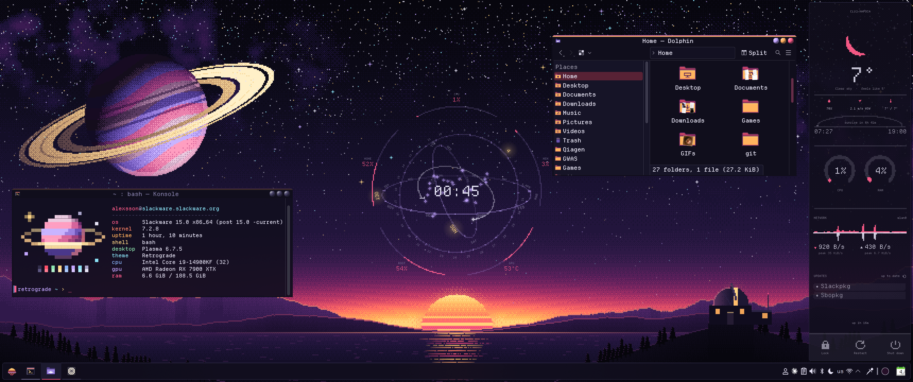
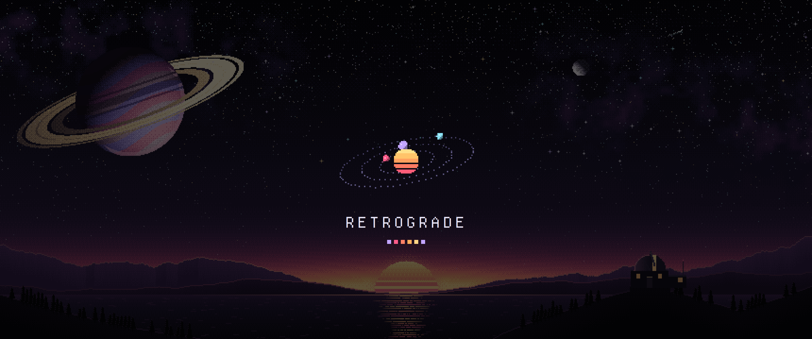
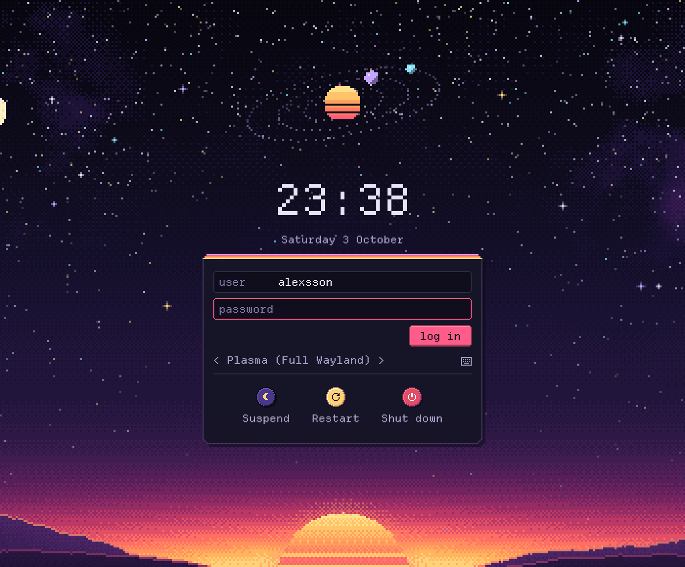
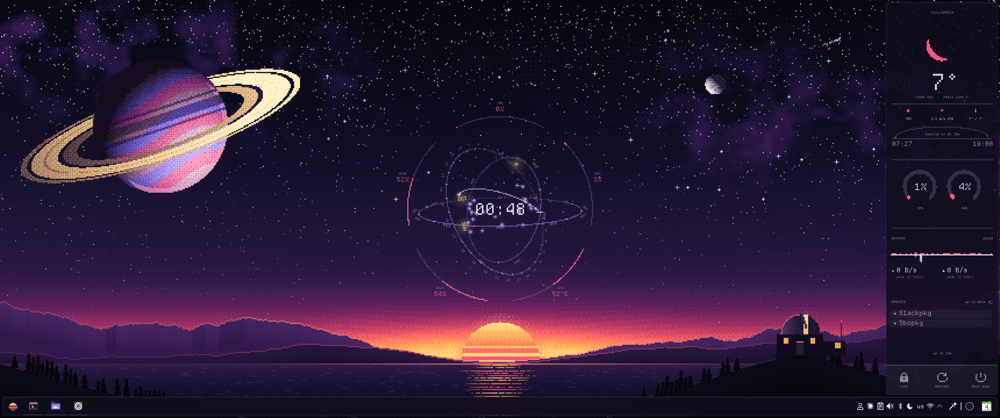

# Retrograde

A dark pixel-art theme for KDE Plasma 6: a dusk sky over an observatory,
planets for window buttons and a sunset stripe on the active window.



## What's in it

- Wallpaper in 17 sizes, ultrawide and laptops included
- Window decoration, Plasma style and colours
- Pixel-art icons and cursors
- Departure Mono, a pixel font
- Splash screen and login screen
- Konsole colours and `retrofetch`
- Pixel versions of Conky Orrery and conky-dashboard



## Install

```bash
./install.sh --apply
```

Or run `./install.sh` and pick Retrograde in System Settings → Colors & Themes
→ Global Theme. Run it again after installing new apps to get pixel icons for
them. `./uninstall.sh` removes everything.

The login screen needs root:

```bash
sudo ./install-sddm.sh
```

Then pick it in System Settings → Colors & Themes → Login Screen (SDDM).



## Font size

Departure Mono is a pixel font, so it's sharpest at certain sizes, and which
ones depends on your display scale. Let a script pick:

```bash
./font-size.sh
```

It uses a sharp size if there's one close to 12 pt, and plain 12 pt if not.
`./install.sh --apply` runs it for you.
`--show` only shows what it would pick, `--size 13` starts from 13 pt.

## Conkies

The pixel conkies are in `extras/`, each with its own README. To start them at
login:

```bash
./install-conky.sh --start
```

Leave out `--start` if you don't want them running right away.
`--remove` takes them out of autostart again.



## Konsole

Pick the Retrograde profile in Konsole's settings. `extras/retrofetch` prints
a system summary next to a pixel planet.

## Building

Everything in `theme/` is generated from `src/`:

```bash
python3 src/build.py
```

You need Python 3 with Pillow and NumPy, `xcursorgen` and `rsvg-convert`.

## License

GPL-3.0-or-later, see `LICENSE` at the top of the repo. The wallpaper is
CC BY-SA 4.0. Departure Mono is by Helena Zhang, under the SIL Open Font
License. Some icons are based on KDE's Breeze icons (LGPL-3.0-or-later).
