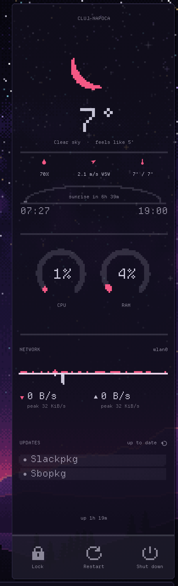

# conky-dashboard, pixel edition

A pixel-art copy of conky-dashboard for the Retrograde theme: weather, CPU and
RAM, network, updates and power buttons.



## Run

```bash
./start_conky.sh
```

Stop the original dashboard first, since they sit in the same spot. If the
panel doesn't show up, look in `.start.log` in this folder.

Click an update row to update: Slackpkg opens [slackpkg-gui](slackpkg-gui/)
(needs PyQt6), Sbopkg opens sbopkg in a terminal.

## Settings

To change the panel's width and text size, run `./dashboard_settings.py`.

The rest is at the top of `lua/dashboard.lua`:

- `pixel_size`: your screen height divided by 360 (4 at 1440p, 3 at 1080p)
- `bg_alpha`: background opacity, from 0 to 1
- `reveal`: `"always"`, or `"hover"` to show it only when you point at the
  right edge (doesn't work well on Wayland)
- `font` and `font_em`: the font and its pixel size (0 for a normal font)

## Weather key

There's no API key in this folder. It reads `.owm_key` from here or from the
original's folder, `~/git/conky-dashboard`. Don't copy or link the key in here.
