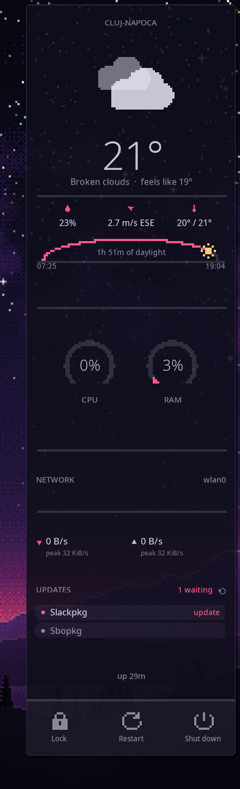

# conky-dashboard, pixel edition

A copy of conky-dashboard drawn as pixel art, in the Retrograde palette, to sit
on the Retrograde wallpaper beside the pixel Orrery.



It shows and does everything the original does: weather, the daylight arc, the
CPU and RAM gauges, the network graph, updates, and the lock / restart / shut
down bar. What changes is how it is drawn:

- **The background is the Plasma panel's.** The same night fill at the same
  translucency, the one-pixel outline stepping round the corners, the bevel
  under the top edge and the hard shadow, drawn at screen resolution as the
  panel draws them. It keeps the 8px gap a floating panel keeps, so its right
  edge lines up with the panel's and the gap above the panel matches.
- **Shapes are pixel art.** The weather icon, the daylight arc, the gauges, the
  network graph, the cards and the bar are drawn on a canvas
  four times smaller than the window, with antialiasing off, and enlarged with
  hard edges. One pixel of the panel is one pixel of the wallpaper's art.
  Lines are a whole number of pixels wide, and nothing is thinner than one.
- **The bottom bar's icons are pixel sprites.** The lock, the circular arrow
  and the power symbol are drawn for the pixel grid rather than shrunk onto it.
- **The daylight sun is a pixel sun** in gold, the wallpaper sun's colour.
- **Text stays sharp,** and so do the small glyphs that sit in a line of text:
  the droplet, wind arrow and thermometer, the network arrows, the update-row
  dots and the refresh button. At three or four pixels across they would not
  survive being pixelated, so they are drawn with the text.
- **The colours are the Retrograde palette:** the theme's pink `#FF5C8A` as the
  accent, coral `#FF8266` at the hot end of a gauge, gold `#FFD685` for the
  sun, and a lavender white `#E7E4F6` for everything structural.

**Run it:**

```bash
~/git/kde-plasma-themes/extras/conky-dashboard-pixel/start_conky.sh
```

It sits where the original does, down the right-hand edge, so stop the
original first. `start_conky.sh` only replaces a panel started from this
folder; it leaves the original alone. If you start the dashboard at login,
point the autostart entry at this folder's `start_conky.sh`, keeping its
`--delay`.

## The weather key

This folder holds no API key, and should not: it is part of a theme you may
share. With `owm_api_key_file` left empty, the panel looks for `.owm_key` in
this folder first and then in the original's, `~/git/conky-dashboard/.owm_key`,
so on your machine the weather keeps working with nothing copied. A
`.gitignore` here keeps a key, and the collectors' data files, out of git all
the same.

Do not put a symlink to the key in this folder either: `zip` follows symlinks
by default, so zipping the theme up would pack the key itself.

## Data and actions

The copy keeps its own `.weather.txt` and `.updates.txt`, written by its own
copies of `openweather.py` and `slackware_updates.bash` on the same 15-minute
timer. The **Slackpkg** row opens the package manager GUI from the original's
folder, `~/git/conky-dashboard/slackpkg-gui`, which is not copied here. The
row stays inert if it is not there.

## Background

The `bg` settings in the config block at the top of `lua/dashboard.lua`.
`bg_alpha` is 0.86, the panel's own translucency. KWin blurs what is behind
the panel and conky cannot ask it to, so the wallpaper's stars show through
the dashboard faintly as dots; `1.0` makes it solid, as the panel goes beside
a maximised window. `0` turns the background off and brings back the accent
stripe down the left edge. `bg_margin` is the gap to the window's edges and
`bottom_gap` the gap above the panel.

## Pixel size

`pixel_size` in the config block at the top of `lua/dashboard.lua`, in screen
pixels. Match the wallpaper: your screen height divided by 360, so 4 at 1440,
3 at 1080, 6 at 2160. `1` draws the panel smooth.

## Where it came from

`lua/dashboard.lua`, `configs/dashboard.conf`, `openweather.py`,
`slackware_updates.bash`, `sbopkg_update.sh` and `start_conky.sh` are copied
from conky-dashboard. Only `lua/dashboard.lua` is changed:

- the palette, with a `sun` colour of its own;
- the background, the Plasma panel's frame (`draw_background`), and
  `bottom_gap` 16 rather than 18;
- the `Pixels` section, `draw_pixelated` and the sprites;
- the key lookup that falls back to the original's folder;
- the Slackpkg action, which points at the original's GUI.

The original's README and CLAUDE.md cover everything else.
